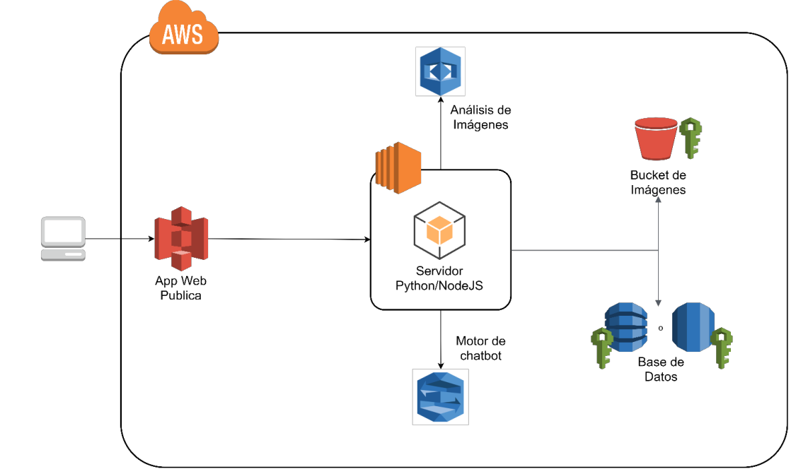

# Manual de configuración

## Descripción de la arquitectura implementada:
La arquitectura que se muestra a continuación, fue implementada mediante la plataforma de Amazon Web Services (AWS). Para el funcionamiento de la misma se trabajó en la interconexión de distintas instancias, objetos, servicios y bases de datos; cuyos papeles se explican más a detalle más adelante.

     
    

     

## App Web Pública
Se utilizó React JS como biblioteca para crear todas las interfaces de usuario y poder utilizar cada función de la aplicación Web. Esta página fue alojada en un bucket S3 configurado para alojar un sitio web estático con acceso público a todo el mundo a través de internet. [Se puede acceder desde aquí](http://practica1.g10.paginaweb.s3-website-us-west-2.amazonaws.com).

 

## Servidor
Se implementaró un servidor con todas las funciones necesarias; las cuales se encargan de procesar cada una de las peticiones realizadas por los usuarios dentro de la aplicación; se conecta por medio del SDK que provee AWS hacia el almacenamiento de S3 y DynamoDB, al igual que la IA de Amazon Rekognition y Amazon Lex. Retornan los datos que sean necesarios para desplegar la información y recursos de los usuarios.

Servidor programado en:
- [Python](https://www.python.org/)

 

## Bucket de imágenes
Para el alojamiento de las imágenes se hizo uso del servicio de Amazon [S3](https://aws.amazon.com/es/s3/), con un bucket específicamente creado para guardar los objetos con un acceso público. Existen únicamente dos carpetas raíces las cuales son: Fotos_Perfil y Fotos_Publicadas; dentro de ellas se encuentran las carperas que hacen referencia a cada usuario, y sus fotos.

 

## Base de datos
Para la persistencia de los datos de los usuarios; se manejó el servicio de [DynamoDB](https://aws.amazon.com/es/dynamodb/) como modelo de base de datos no relacional.
Únicamente fueron necesarias dos tablas, una 'Users' para los datos personales del usuario y otra tabla 'Photos' en donde fueron registradas las referencias de las imágenes que se encuentran cargadas en el bucket de S3.

 

## Roles de IAM
Para el uso y gestión adecuada de la plataforma AWS, se crearon distintos usuarios de [IAM](https://docs.aws.amazon.com/es_es/IAM/latest/UserGuide/id_users.html).
De forma predeterminada, un nuevo usuario de IAM no tiene permisos para realizar ninguna actividad; por lo que fueron asignados distintos roles de usuario dependiendo el uso que se le fuera a dar. Para esta práctica se utilizaron:
- daniel_db: Encargado de gestionar los servicios de almacenamiento mediante las políticas de acceso para Bucket S3 y DynamoDB. También tiene acceso al servicio de Amazon Rekognition y Amazon Translate.

- edson: Rol con permiso de crear instancias EC2 y el manejo de tráfico mediante AWS Load Balancing. Tiene acceso a Amazon Rekognition.

- juanpablo: Permiso de crear y gestionar instancias EC2 para ejecutar los servidores. Tiene acceso a Amazon Lex para la implementación y desarollo del Chatbot.

- pablo: Acceso administrador, se utilizó para alojar la página web a un bucket S3 de manera estática y pública.

 

## Capturas de pantalla
 

### Buckets S3

    
      

### Instancias EC2

    
    
      

### Tablas de DynamoDB

    
    
      

### Aplicación Web

    
      

### Funciones de Amazon Rekognition implementadas:

    
      

    
      

    
      

